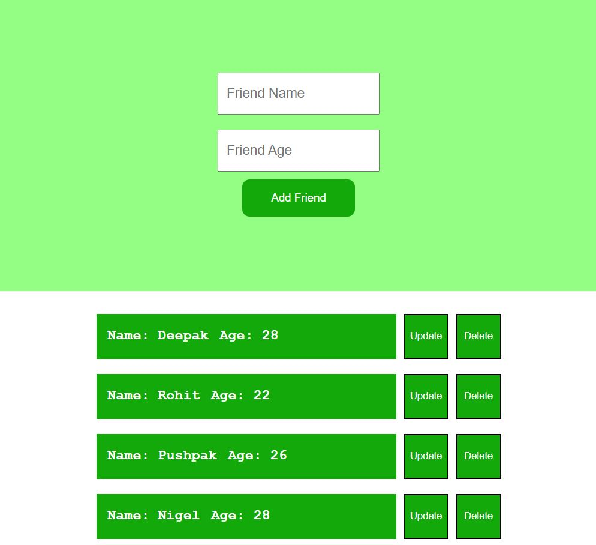
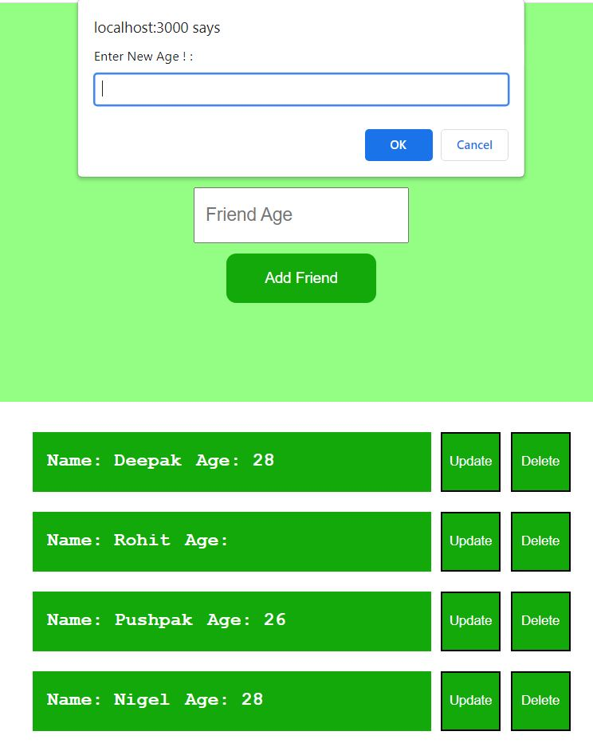
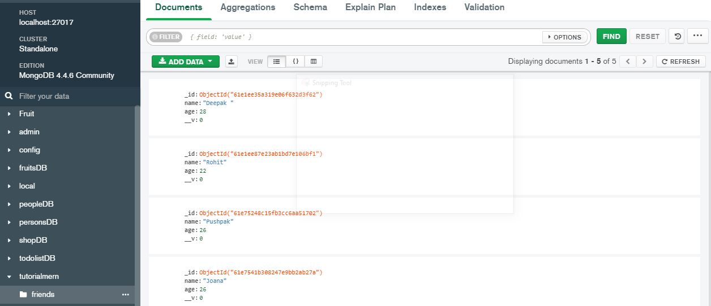

## Key Learnings

- Fully understood and implemented React fundamentals, react hook.
- Implemented the basics of Node.js.
- Used Semantic HTML.
- Flexbox, SASS.
- Heroku
- MySQL Databse
- Netlify

## Installation

### Clone

- Clone this repo to your local machine using `https://github.com/dennisagarwal/friendlist-mongoDB.git`

### Setup

**1.** Navigate to the friendlist-mongoDB/client folder in your terminal and install npm like this:

```
$ npm install
```

**2.** Navigate to the friendlist-mongoDB/server folder in your terminal and install npm like this:

```
$ npm install
```

### Launch application

```
$ npm start (on client side)
```

```
$ node index.js (on server side)
```

## Tech Stack

- React JS.
- React Hook.
- Node.js
- APIs.
- HTML.
- Flexbox.
- MongoDB
  -Atlas
- Heroku
- MySQL
- Netlify

#### Website Glimpse

**1.** Landing Page



**2.** Update Age



**3.** MongoDB Database



##### Website Link

https://clever-jepsen-23c9c5.netlify.app/
